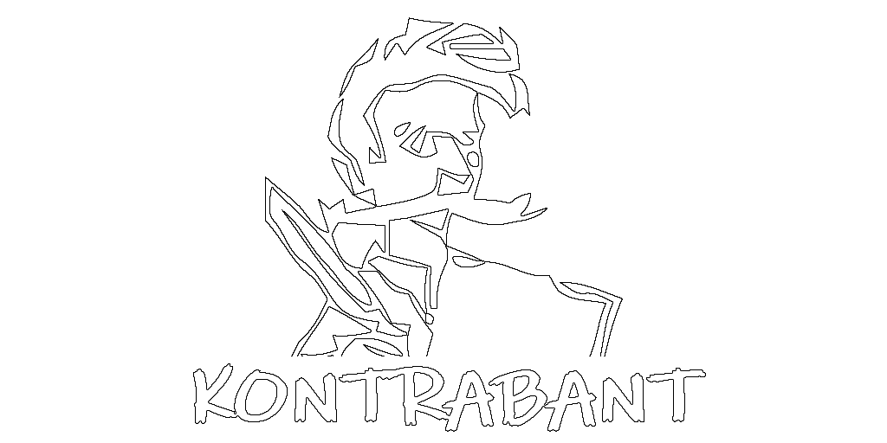

![status.badge] [![language.badge]][language.url] [![standard.badge]][standard.url] [![license.badge]][license.url]

# idp-quill

This repository contains the Quill adventures ports for the Iskra Delta Partner: Kontrabant, Kontrabant II., and Eurorun.

## Compiling

*To compile, you will need a Linux machine with the latest version of the SDCC suite.*

This repository uses submodules. When you clone it, don't forget to add the `--recursive` switch.

Use `make` to compile all games. 

Afterwards, you can find the disk image in the `bin/` directory and the `*.com` files in the `build/` directory.

# Screenshots & Solutions

## Kontrabant II.

Kontrabant II. - [the solution.](docs/kontrabant2-resitev.txt)

## Kontrabant I.

## Eurorun

# Credits

Many thanks to the **The Part Time Nerds**, the **The Oddbit Labs**, [**Miha Grcar**](https://github.com/mgrcar), [**Janez Demsar**](https://github.com/janezd) and **Ziga Turk** for their support.

[language.url]:   https://en.wikipedia.org/wiki/ANSI_C
[language.badge]: https://img.shields.io/badge/language-C-blue.svg

[standard.url]:   https://en.wikipedia.org/wiki/C89/
[standard.badge]: https://img.shields.io/badge/standard-C89-blue.svg

[license.url]:    https://github.com/tstih/idp-quill/blob/main/LICENSE
[license.badge]:  https://img.shields.io/badge/license-MIT-blue.svg

[status.badge]:  https://img.shields.io/badge/status-stable-dkgreen.svg
